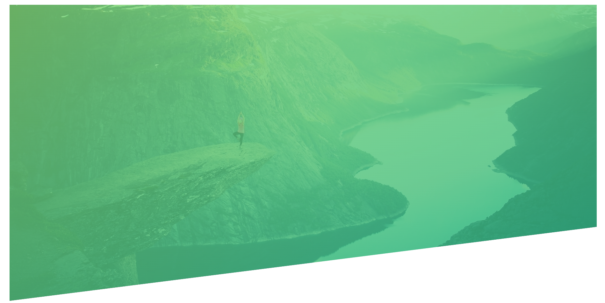
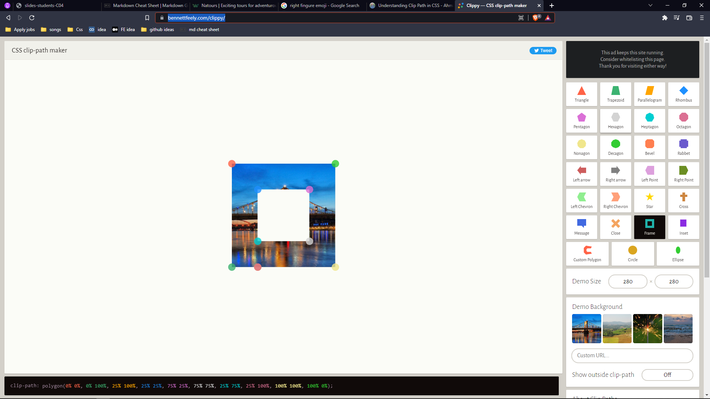

# Topics I have learned while making this project

👇 **_Plus, I made notes for quick revision_** 👇

## Lecture 1


### 1. Basic Reset 👇

- Instead of adding font-family in universal selector, add it into a body selector.

```
* {
    margin: 0;
    padding:0;
    box-sizing: border-box;
}

html{
    font-size: 62.5%
}

body {
    font-family: font name;
}
```

---

<br />

### 2. Header Background + Image 👇



- **Background size cover** means covering the whole div which also includes zoom in the picture.
- **Background size contain** means it will not zoom in the pic and exact size of the image will be displayed.
- The **clip-path** property creates a clipping region where content within it is visible, and content outside it is invisible.
- Always set **image url** after the **background gradient**.

```
.header {
  height: 95vh;
  background-image: linear-gradient(
      to right bottom,
      rgba(126, 213, 111, 0.8),
      rgba(126, 213, 111, 0.8)
    ),
    url(../img/hero.jpg);
  background-size: cover;
  background-position: top;
  clip-path: polygon(0 0, 100% 0, 100% 75%, 0 100%);
}
```

---

</br>

### **_You can generate more clip path from this site_** 👉 [site Link](https://bennettfeely.com/clippy/)



---

<br />

### 3 Logo 👇


```
  <div class="logo-box">
        
  </div>

  .header{
    position: relative;
  }

  .logo-box {
  position: absolute;
  top: 4rem;
  left: 4rem;
}

.logo {
  height: 3.5rem;
}

```

---

<br />
