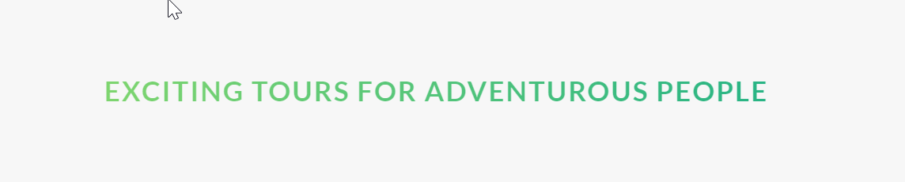

# Gradient Heading Using Clip Path



`-webkit-background-clip: text;` this will clip the background below the text and by using `color:transparent` we can show the gradient text. Also we have used `skew` for animation.

Code example 👇

```
.heading-secondary {
  font-size: 3.5rem;
  text-transform: uppercase;
  font-size: 700;
  display: inline-block;
  background-image: linear-gradient(
    to right,
    $color-light-green,
    $color-dark-green
  );
  -webkit-background-clip: text;
  color: transparent;
  letter-spacing: 0.2rem;
  transition: all 0.2s;

  &:hover {
    transform: skewY(1deg) skewX(15deg) scale(1.1);
    text-shadow: 0.5rem 1rem 2rem rgba($color-black, 0.2);
  }
}
```
