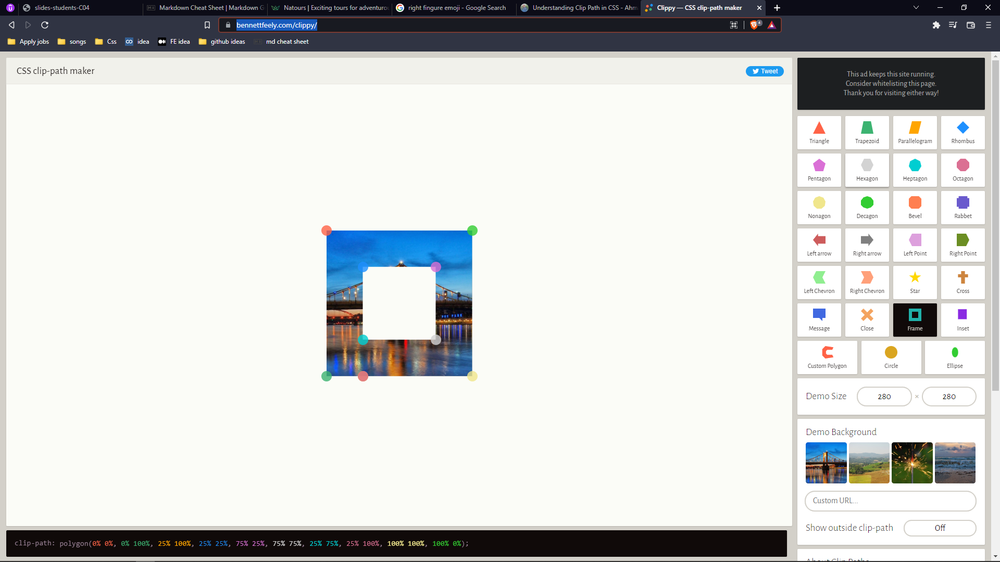
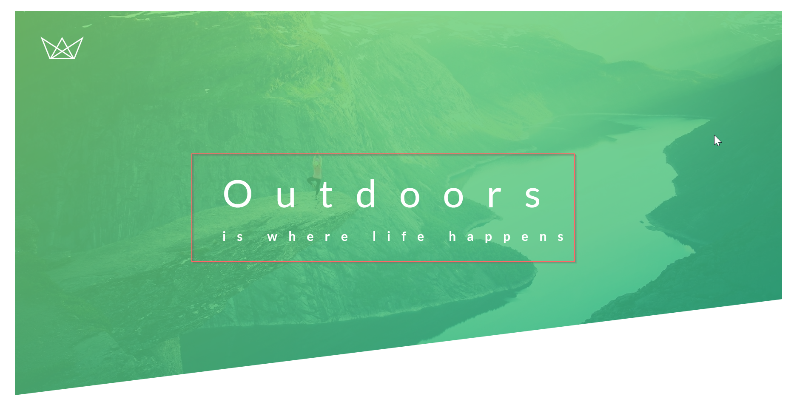

# Topics I have learned while making this project

👇 **_Plus, I made notes for quick revision_** 👇

## Lecture 1


### 1. Basic Reset 👇

- Instead of adding font-family in universal selector, add it into a body selector.

```
* {
    margin: 0;
    padding:0;
    box-sizing: border-box;
}

html{
    font-size: 62.5%
}

body {
    font-family: font name;
}
```

---

<br />

### 2. Header Background + Image 👇


- **Background size cover** means covering the whole div which also includes zoom in the picture.
- **Background size contain** means it will not zoom in thepic and exact size of the image will be displayed.
- The **clip-path** property creates a clipping region where content within it is visible, and content outside it is invisible.
- Always set **image url** after the **background gradient**.

```
.header {
  height: 95vh;
  background-image: linear-gradient(
      to right bottom,
      rgba(126, 213, 111, 0.8),
      rgba(126, 213, 111, 0.8)
    ),
    url(../img/hero.jpg);
  background-size: cover;
  background-position: top;
  clip-path: polygon(0 0, 100% 0, 100% 75%, 0 100%);
}
```

---

</br>

### **_3 You can generate more clip path from this site_** 👉 [site Link](https://bennettfeely.com/clippy/)



---

<br />

### 4 Logo 👇


```
  <div class="logo-box">
        
  </div>

  .header{
    position: relative;
  }

  .logo-box {
  position: absolute;
  top: 4rem;
  left: 4rem;
}

.logo {
  height: 3.5rem;
}

```

---

<br />

### 4 Centering text-box with 'POSITION + TRANSLATE) 👇



- **Translate** will move the box on X,Y axis half of it's width and height

```
.text-box {
  position: absolute;
  top: 40%;
  left: 50%;
  transform: translate(-50%, -50%);
}
```

---

<br/>

### 5 Animation 👇

- We use **'@keyframes animation name'** to make an animation

```
@keyframes moveInLeft {
  0% {
    opacity: 0;
    transform: translateX(-10rem);
  }
  80% {
    transform: translateX(2rem);
  }
  100% {
    opacity: 1;
    transform: translateX(0);
  }
}


```

- The above animation means that the animation will start with the **opacity 0 and also from the left side** .
- To use the animation we use **'animation-name: moveInLeft'**
- **Duration** means how much time the animation will tak eto complete.
- **Delay** means the animation will start after 3 sec.
- **Iteration** count means repetition
- **Animation Timing Function ease out** means that the animation will start faster and end slowly

```
  animation-name: moveInLeft;
  animation-duration: 5s;
  animation-delay: 3s;
  animation-iteration-count: 3;
  animation-timing-function: ease-out;
```

- **Short hand Property** to mention all above property

```
  animation: name duration timing-function delay iteration-count direction fill-mode;
```

---

<br />

### 6 Button + Animation 👇


- First create an anchor element with the class name btn

```
<a href="#" class="btn btn-white btn-animated">Discover our tours</a>
```

- Then style the anchor tag

```
.btn:link,
.btn:visited {
  text-decoration: none;
  text-transform: uppercase;
  padding: 1.5rem 4rem;
  display: inline-block;  -> Now it will behave as text
  border-radius: 10rem;

  transition: all 0.2s;
  position: relative;
}

.btn:hover {
  transform: translateY(-3px);
  box-shadow: 0 10px 20px rgba(0, 0, 0, 0.2);
}

.btn:active {
  transform: translateY(-1px);
  box-shadow: 0 5px 10px rgba(0, 0, 0, 0.2);
}
```

- Above we have use transition which means it will take 0.2s while transforming.
- On hovering we will create bigger box shadow.
- On click we will make the shadow small.

```
.btn-white {
  background-color: var(--white);
  color: var(--grey);
}

.btn::after {
  content: "";
  display: inline-block;
  height: 100%;
  width: 100%;
  border-radius: 10rem;
  position: absolute;
  top: 0;
  left: 0;
  z-index: -1;

  transition: all 0.4s;
}

.btn-white:after {
  background-color: var(--white);
}
```

- **AFTER** will create a content just after button with 100% height and width.
- To take the exact area we have used absolute positioning and z-index too.

```
.btn:hover::after {
  transform: scaleX(1.4) scaleY(1.6);
  opacity: 0;
}
```

- This will scale the **AFTER** box and just after zoom in the opacity will become 0.

```

.btn-animated {
  animation: moveInUp 0.5s ease-out 0.75s;
  animation-fill-mode: backwards;
}
```

- If we don't use animation-fill-mode backwards then the button will show in the starting and after 0.75s it will apply animation.
- So backwards help us to assign the animation before the delay.
