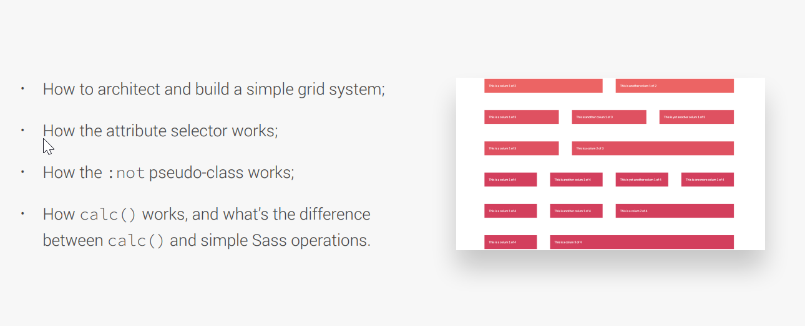

# Make Grid Using Float



## HtML Structure

Code example 👇

```
<section class="grid-test">
      <div class="row">
        <div class="col-1-of-2">Col 1 of 2</div>
        <div class="col-1-of-2">Col 2 of 2</div>
      </div>

      <div class="row">
        <div class="col-1-of-3">Col 1 of 3</div>
        <div class="col-1-of-3">Col 2 of 3</div>
        <div class="col-1-of-3">Col 3 of 3</div>
      </div>

      <div class="row">
        <div class="col-1-of-3">Col 1 of 3</div>
        <div class="col-2-of-3">Col 2 of 3</div>
      </div>

      <div class="row">
        <div class="col-1-of-4">Col 1 of 4</div>
        <div class="col-1-of-4">Col 2 of 4</div>
        <div class="col-1-of-4">Col 3 of 4</div>
        <div class="col-1-of-4">Col 4 of 4</div>
      </div>

      <div class="row">
        <div class="col-1-of-4">Col 1 of 4</div>
        <div class="col-1-of-4">Col 2 of 4</div>
        <div class="col-2-of-4">Col 3 of 4</div>
      </div>

      <div class="row">
        <div class="col-1-of-4">Col 1 of 4</div>
        <div class="col-3-of-4">Col 3 of 4</div>
      </div>
    </section>
```

## CSS Structure

- On using `float` height on the div become `0` so to fix this issue we use `clearfix`

Code example 👇

```
// Variables
$grid-width: 114rem;
$gutter-vertical: 8rem;
$gutter-horizontal: 6rem;

// Mixins
@mixin clearfix {
  &::after {
    content: "";
    display: table;
    clear: both;
  }
}
```

- Try to use `max-width` whenever possible.
- ` &:not(:last-child)` will give margin bottom to each element leaving the last element.
- `[class^="col-"]` it will select all the class starting with the name `col-`

Code example 👇

```
.row {
  max-width: $grid-width;
  background-color: rgb(211, 209, 209);
  margin: 0 auto;

  &:not(:last-child) {
    margin-bottom: $gutter-vertical;
  }

  @include clearfix();

  //   Class starting with name col
  [class^="col-"] {
    background-color: orangered;
    float: left;

    &:not(:last-child) {
      margin-right: $gutter-horizontal;
    }
  }
```

- `.col-1-of-2` means we are selecting first colum and giving it's width.
- `100%` means full `.row` width `-` the `horizontal gap`.
- `2` means it has `2 column`
- In `2 colum` we have `only one gap`.

Code example 👇

```
.col-1-of-2 {
  width: calc((100% - #{$gutter-horizontal}) / 2);
}

.col-1-of-3 {
  width: calc((100% - 2 * #{$gutter-horizontal}) / 3);
}

 .col-1-of-4 {
  width: calc((100% - 3 * #{$gutter-horizontal}) / 4);
  // 3 means 3 gap
}
```

- we are` multiplying by 2` because it's `taking 2 colum` + `including the gap`

Code example 👇

```

.col-2-of-3 {
  width: calc(
    2 * ((100% - 2 * #{$gutter-horizontal}) / 3) + #{$gutter-horizontal}
  );
}

.col-2-of-4 {
  width: calc(
    2 * ((100% - 3 * #{$gutter-horizontal}) / 4) + #{$gutter-horizontal}
  );
}

.col-3-of-4 {
  width: calc(
    3 * ((100% - 3 * #{$gutter-horizontal}) / 4) + 2 * #{$gutter-horizontal}
  );
}
}
```
