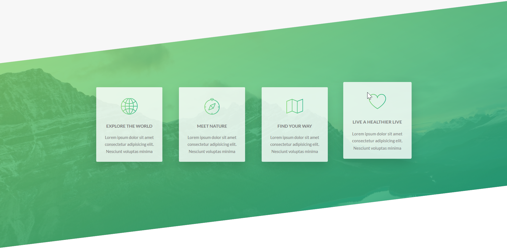

# Third Section Cards and skewed background



## HTMl Structure

First we will make th structure. We have already discussed about the grid component in [grid section](13-float.md)

Code example 👇

```
    <section class="section-features">
        <div class="row">

          <div class="col-1-of-4">
            <div class="feature-box">
              <i class="feature-box__icon icon-basic-world"></i>
              <h3 class="heading-tertiary u-margin-bottom-small">
                Explore the world
              </h3>
              <p class="feature-box__text">
                Lorem ipsum dolor sit amet consectetur adipisicing elit.
                Nesciunt voluptas minima
              </p>
            </div>
          </div>

          <div class="col-1-of-4">
            <div class="feature-box">
              <i class="feature-box__icon icon-basic-compass"></i>
              <h3 class="heading-tertiary u-margin-bottom-small">
                Meet nature
              </h3>
              <p class="feature-box__text">
                Lorem ipsum dolor sit amet consectetur adipisicing elit.
                Nesciunt voluptas minima
              </p>
            </div>
          </div>
        </div>
    </section>

```

## Background Designing

we will create a `div` with the class name `section-feature`. We will use `skey` to style `position` of our `background`
` & > *` means it will select the first child element of the container.

Code example 👇

```
.section-features {
  padding: 20rem 0;
  background-image: linear-gradient(
      to right bottom,
      rgba($color-primary, 0.8),
      rgba($color-primary-dark, 0.8)
    ),
    url(../img/nat-4.jpg);
  background-size: cover;
  margin-top: -11.4rem;

  transform: skewY(-7deg);

  & > * {
    transform: skewY(7deg);
  }
}
```

## Card Designing

Code example 👇

```
.feature-box {
  background-color: rgba($color-white, 0.8);
  font-size: 1.5rem;
  padding: 2.5rem;
  text-align: center;
  border-radius: 3px;
  box-shadow: 0 1.5rem 4rem rgba($color-black, 0.15);
  transition: all 0.3s;

  &:hover {
    transform: translateY(-1.5rem) scale(1.03);
  }

  &__icon {
    font-size: 6rem;
    margin-bottom: 0.5rem;
    background-image: linear-gradient(
      to right,
      $color-primary,
      $color-primary-dark
    );
    -webkit-background-clip: text;
    color: transparent;
  }
}
```
