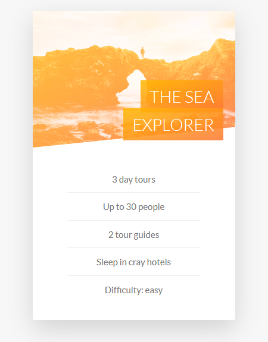

# Rotating Cards



First we will be designing our front side of the card.

## HTML Structure

Code example 👇

```
 <div class="card">
              <div class="card__side card__side--front">

                    <div class="card__picture card__picture--1">&nbsp;</div>

                    <h4 class="card__heading">
                        <span class="card__heading-span card__heading-span--1"> The Sea Explorer </span>
                    </h4>

                    <div class="card__details">
                        <ul>
                            <li>3 day tours</li>
                            <li>Up to 30 people</li>
                            <li>2 tour guides</li>
                            <li>Sleep in cray hotels</li>
                            <li>Difficulty: easy</li>
                        </ul>
                    </div>
              </div>

              <div class="card__side card__side--back card__side--back-1">
                Back
              </div>
            </div>
</div>
```

## Css styling

We will work on the functionality first. We learned some new CSS properties like `perspective`, `backface-visibility`, `background-blend-mode`

- `box-decoration-break: clone;` will make the heading element to 2 different element

- This thing will help us to rotate the card along y axis.

```
  &:hover &__side--front {
    transform: rotateY(-180deg);
  }
```

```
.card {
  // Functionality

  perspective: 150rem;  //   Lower the value more dramatic the effect will be, so better take higher value
  -moz-perspective: 150rem;
  position: relative;
  height: 52rem;

  &__side {
    height: 52rem;
    width: 100%;
    transition: all 0.8s ease;
    color: white;
    font-size: larger;
    position: absolute;
    top: 0;
    left: 0;
    backface-visibility: hidden;
    border-radius: 0.3rem;
    box-shadow: 0 1.5rem 4rem rgba($color-black, 0.15);

    &--front {
      background-color: $color-white;
    }
    &--back {
      background-color: bisque;
      //   Flipping the back card before starting
      transform: rotateY(180deg);

       &-1 {
        background-image: linear-gradient(
          to right bottom,
          $color-secondary-light,
          $color-secondary-dark
        );
    }
  }

  &:hover &__side--front {
    transform: rotateY(-180deg);
  }

  &:hover &__side--back {
    transform: rotateY(0);
  }

  // Front side styling
  &__picture {
    background-size: cover;
    height: 23rem;
    background-blend-mode: screen;
    clip-path: polygon(0 0, 100% 0, 100% 85%, 0 100%);
    -webkit-clip-path: polygon(0 0, 100% 0, 100% 85%, 0 100%);

    &--1 {
      background-image: linear-gradient(
          to right bottom,
          $color-secondary-light,
          $color-secondary-dark
        ),
        url(../img/nat-5.jpg);
    }

    &--2 {
      background-image: url(../img/nat-5.jpg);
    }

    &--3 {
      background-image: url(../img/nat-5.jpg);
    }
  }

  &__heading {
    font-size: 2.8rem;
    font-weight: 300;
    text-transform: uppercase;
    color: $color-white;
    text-align: right;
    position: absolute;
    top: 12rem;
    right: 2rem;
    width: 75%;
  }

  &__heading-span {
    padding: 1rem 1.5rem;
    box-decoration-break: clone;
    -webkit-box-decoration-break: clone;

    &--1 {
      background-image: linear-gradient(
        to right bottom,
        rgba($color-secondary-light, 0.85),
        rgba($color-secondary-dark, 0.85)
      );
    }
  }

  &__details {
    padding: 3rem;

    ul {
      list-style: none;
      margin: 0 auto;
      width: 80%;
    }

    li {
      color: $color-grey;
      text-align: center;
      font-size: 1.5rem;
      padding: 1rem;

      &:not(:last-child) {
        border-bottom: 1px solid #eee;
      }
    }
  }
}
```
