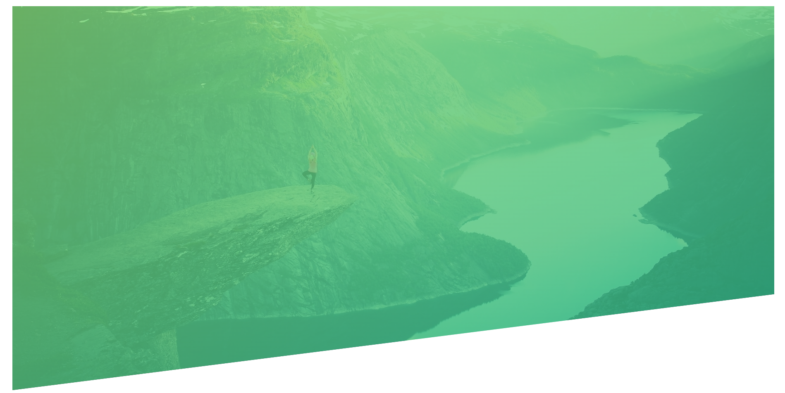

# Background image + gradient + clip-path



- First we will add `linear gradient` in our background-image with `0.8 opacity` and after that we will use the image with the help of `url`
- **Background-size:**
  - `cover` will cover the whole div which also includes zoom in the picture.
  - `contain` will display the exact size of the picture.
- The `clip-path` property creates a clipping region where the content within is visible, and content outside is invisible
- To `generate different clip-path` you can check this site - [click here](https://bennettfeely.com/clippy/)

Code example 👇

```
.header {
  height: 95vh;
  background-image: linear-gradient(
      to right bottom,
      rgba(126, 213, 111, 0.8),
      rgba(126, 213, 111, 0.8)
    ),
    url(../img/hero.jpg);
  background-size: cover;
  background-position: top;
  clip-path: polygon(0 0, 100% 0, 100% 75%, 0 100%);
}
```
