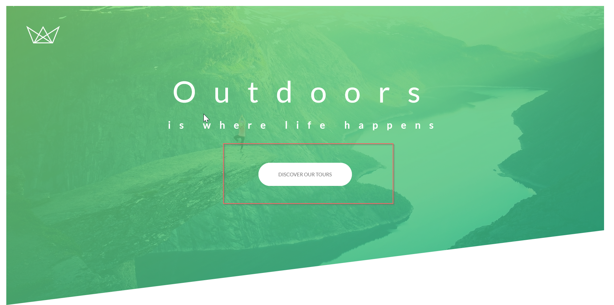

# Button Animation

## Create Button



Create an `anchor element` with the class name `btn`

```
<a href="#" class="btn btn-white btn-animated">Discover our tours</a>
```

## Styling Button

- We have used `transition`, so while hovering or active it take `0.2s` time.
- on `hovering` we will create bigger `box-shadow` and on clicking (`active`) we will make the shadow small.

Code example 👇

```
.btn:link,
.btn:visited {
  text-decoration: none;
  text-transform: uppercase;
  padding: 1.5rem 4rem;
  display: inline-block;  -> Now it will behave as text
  border-radius: 10rem;
  transition: all 0.2s;
  position: relative;
}
.btn:hover {
  transform: translateY(-3px);
  box-shadow: 0 10px 20px rgba(0, 0, 0, 0.2);
}
.btn:active {
  transform: translateY(-1px);
  box-shadow: 0 5px 10px rgba(0, 0, 0, 0.2);
}
```

## White Button

- `:after` will create a content just after button with `100% height and width`.
- `absolute` will arrange the `after content` in the exact position of the button

```
.btn-white {
  background-color: var(--white);
  color: var(--grey);
}

.btn::after {
  content: "";
  display: inline-block;
  height: 100%;
  width: 100%;
  border-radius: 10rem;
  position: absolute;
  top: 0;
  left: 0;
  z-index: -1;
  transition: all 0.4s;
}
.btn-white:after {
  background-color: var(--white);
}
```

## Hover After Button

- `scale` will zoom in the content and with the help of `opacity:0` it will get invisible.

```
.btn:hover::after {
  transform: scaleX(1.4) scaleY(1.6);
  opacity: 0;
}
```

## Animated Button

- If we don't use `animation-fill-mode backwards` then the button will show in the starting and after 0.75s it will apply animation.
- So backwards help us to assign the `animation before the delay`.

```
.btn-animated {
  animation: moveInUp 0.5s ease-out 0.75s;
  animation-fill-mode: backwards;
}
```
