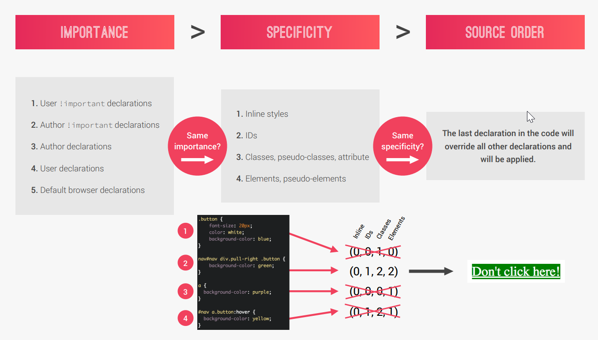

# How Css Apply Styling

- CSS declaration marked with `!important` have highest priority.
- But,only use `!important` as a last resource. It's better to use correct specificities - `more maintainable code!`
- `Inline` styles will always have priority over styles in external stylesheets.
- A selector that contains `1 ID` is more specific than one with 1000 classes.
- A selector that contains `1 class` is more specific than one with 1000 elements.
- The `universal selector *` has no specific value (0 0 0 0)
- Rely more on `specificity` than on the `order` os selectors.
- But, rely on `order` when using 3rd-party stylesheets - `always put your author stylesheet last`

